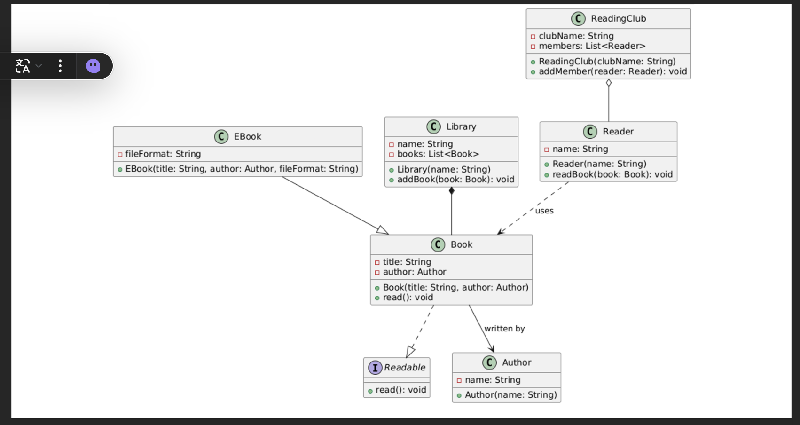

# Java_Relationships
This project tells about relationships in java

Explanation
📖 Readable Interface:

Defines a contract with a read() method. The Book class implements this interface, ensuring that all books provide a reading behavior.

‍

📲 Book and EBook:

Book has attributes for title and an associated Author. EBook extends Book by adding a fileFormat attribute. The inheritance arrow (solid line with a closed arrowhead) shows that EBook is a specialized type of Book.

‍

🔗 Association (Book & Author):

The arrow from Book to Author indicates that every book is written by an author. This is a simple association where both objects can exist independently.

‍

📚 Composition (Library & Book):

The filled diamond from Library to Book indicates composition. A library is composed of books, meaning the library strongly owns its books.

‍

📖➡️📕 Dependency (Reader & Book):

The dashed arrow from Reader to Book denotes a dependency. A reader uses a book (for example, to read), but does not own it.

‍

📚➡️👥 Aggregation (ReadingClub & Reader):

The open diamond from ReadingClub to Reader represents aggregation. A reading club groups readers together, but readers can exist independently of the club.